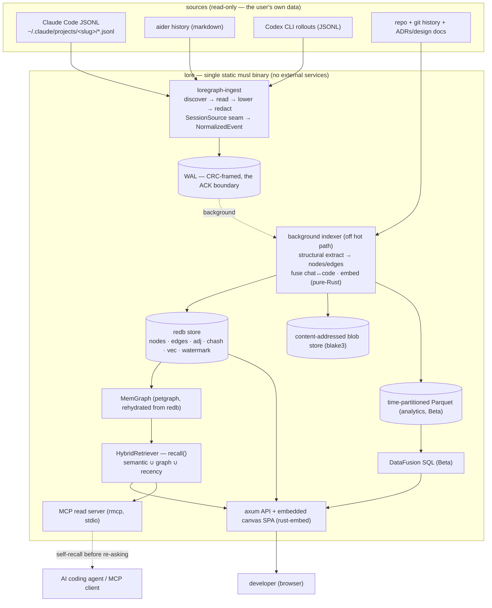
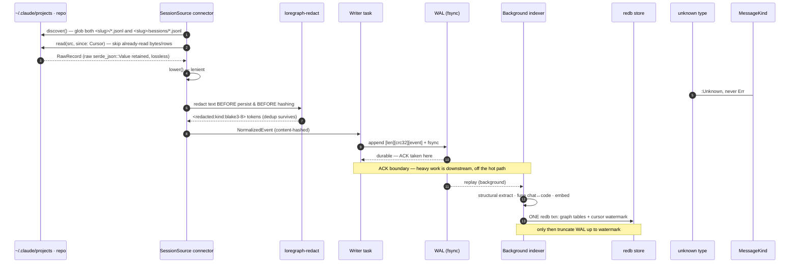
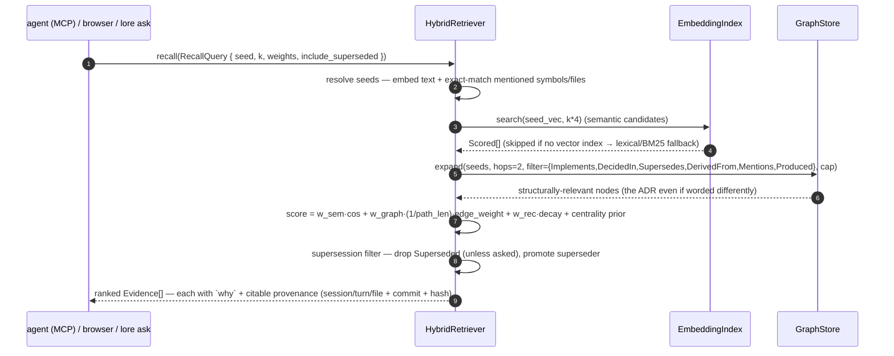

# loregraph — Architecture

> The internals: the durable graph store + crash-safe commit protocol, the
> content-addressed graph model, the ingest pipeline, the retrieval engine, the
> canvas, and the engine seams. For the phased build plan, the crate stack, and the
> honest moat, see [`PLAN.md`](./PLAN.md).
>
> Status: **early PoC — the core slice runs** (`index` / `ask` / `serve` / `mcp` /
> `doctor`). Last updated 2026-06-29.

loregraph (package `loregraph`, lib/bin `lore`) is **one process, one static binary** with
no external services. Two producers — chat transcript ingest and repo crunch — feed a
single durable **memory knowledge graph**; consumers — the canvas SPA and the read-only MCP
server — read it. The two halves are decoupled by a crash-safe **WAL → redb** commit
protocol so **heavy work runs off the ingest hot path**.

## 0. As-built vs design target

This doc describes both the **design** (the durable vision) and the **as-built** PoC. They
have diverged as the PoC favored concrete, dependency-light types over the fully-abstracted
seam design; this table is the single source of truth for what runs today. Sections below
carry **As-built** notes where they differ from the original design prose.

| Component | As-built today | Design target (deferred) |
|---|---|---|
| Ingest path | **Synchronous** — `ingest_session` / `ingest_repo` build a `WalRecord` batch → WAL append+fsync → apply to memory; `save()` checkpoints to redb | async single-writer task + bounded mpsc + background indexer |
| WAL record | `WalRecord` = `Node \| Edge \| Vector` (CRC-framed) | `NormalizedEvent` stream |
| redb tables | `nodes`, `edges`, `vectors` (raw f32 LE bytes), `meta` (embedder id/dim) | `+ adj`, `chash`, `cursors`, `watermark`, Parquet tier |
| Dedup / re-index | content-addressed `NodeId` upsert (idempotent); **full re-index** each run | per-source `Cursor` watermarks + incremental checkpoint |
| Embedder | `DynEmbedder` enum (`HashEmbedder` default \| `StaticEmbedder` GloVe word-vectors), **runtime-selected via env**; id+dim stamped in `meta`, mismatch refused | feature-gated neural (model2vec/fastembed/candle) |
| Vector index | `BruteForceIndex` (exact cosine, id→slot map, O(1) upsert) | HNSW (`index-hnsw`), usearch |
| Retriever | `ask::recall(store, query, k)` **free function** — R1 kind-prior + value-node semantic set, graph hop, exact-lexical, **BM25 fallback**, R4 centrality (value nodes) + supersession finalize | `Retriever` trait + `HybridRetriever` + `RecallQuery{weights,seed,…}` |
| commit-provenance | **gix in the default build** — `Commit` nodes, `File`-`ChangedBy`, contemporaneous `commit` stamped on sessions (`same_git_tree` guard) | (was Beta; shipped early) |
| Decision extraction | deterministic cue-phrase + noise/substance filter (`is_low_value_turn`); **`byo-llm` scaffolded** behind a feature | byo-llm wired into ingest; Pattern/DebtSignal |
| Canvas | **hand-rolled Canvas2D force sim** in `frontend/app.js` (no build step) | vendored Cytoscape.js → Sigma.js, server-side layout precompute |
| MCP | **real `rmcp` stdio server** behind `--features mcp` | + Streamable-HTTP transport, resources/prompt (planned) |
| Parquet / DataFusion | not built | Beta analytical tier |

Engine seams are **concrete types today** (`Store`, `MemGraph`, `BruteForceIndex`,
`DynEmbedder`, `ask::recall`), not the object-safe traits §7 sketches — that abstraction is
deferred until a second backend actually needs it.

## 1. System context



**Altitude boundary (stated once).** loregraph is the session-memory / knowledge-graph
layer; it is **not** a wire cache (that is recall, module 61 — it avoids re-*calling* the
model; loregraph avoids re-*asking* the agent), **not** a trace/eval store (that is
evald, module 62; loregraph *may* read through an evald store as one more source rather
than re-ingesting spans), and **not** an MCP gateway (that is MCPd, module 58; loregraph
is one MCP *server* MCPd can front and govern). They compose at different altitudes; no
runtime coupling, no cross-workspace build dependency.

## 2. The store + crash-safe commit protocol

The durability spine is the house WAL/watermark protocol (the same pattern evald uses
for its hot→cold Parquet commit, adapted here to graph mutations instead of columnar
blocks). The unsolved problem a naive design gets wrong: a single logical ingest crosses
three stores — the WAL, the redb graph index, and (Beta) the Parquet analytical tier — so
an unframed "just write everything" can double-count or lose data on a crash. The
protocol makes the redb txn the single linearization point.

> **As-built (§2.1–§2.3):** the durability *contract* below holds, but the PoC is
> **synchronous**, not the async writer-task/background-indexer design. `ingest_session` /
> `ingest_repo` build a batch of `WalRecord`s, `commit_mutations` appends them to the WAL
> with one `fsync` (the ACK), then applies them to the in-memory `MemGraph` +
> `BruteForceIndex`. `Store::save()` is the **checkpoint**: it folds the whole in-memory
> state into redb in one write transaction, then truncates the WAL. There is no mpsc writer
> task, no separate background-indexer thread, and no Parquet staging step yet — extraction
> and embedding run inline on the ingest call. The WAL frames `WalRecord` (`Node`/`Edge`/
> `Vector`), not `NormalizedEvent`.

### 2.1 The WAL is the ACK boundary

All ingest funnels through **one in-process writer task** fed by a bounded
`tokio::mpsc` channel (backpressure via `send().await`; on overload the hosted note path
sheds with `429 + Retry-After`, never a silent drop). The writer:

1. Frames each event `[len][crc32][serialized NormalizedEvent]`.
2. Appends to a durable WAL segment and **`fsync`s before the ACK** — so client-visible
   latency is decoupled from any indexing or layout stall downstream. The event is a
   content-addressed, idempotent `IngestEvent` (upsert-node / upsert-edge / observe).

The single writer removes the multi-process file-lock problem; it is also the throughput
ceiling, which is exactly why the ACK is taken at the WAL and not after indexing.

### 2.2 The background indexer commits in ONE redb transaction

Off the hot path, the indexer folds WAL events into a `GraphBatch` (structural
extraction, chat↔code fusion, re-embedding of new text), then commits with this exact
ordering:

1. (Beta) **stage** any analytical Parquet block under a **watermark-/content-hash-derived
   name** (temp path → `fsync` file → `fsync` dir) — do **not** publish it yet.
2. In **one redb write transaction**, update `{nodes, edges, adj, chash, vec}` **and**
   advance the **watermark** (the WAL offset / per-source cursor / per-repo HEAD oid that
   this batch covers) — together, atomically. This txn is the single linearization point.
3. **Only after** that commit is durable, **publish/promote the Parquet artifact** (atomic
   rename into place), **then** truncate the WAL up to that watermark (and drop the
   in-memory hot group). Because the artifact name is derived from the batch
   watermark/hash, a retry after a crash re-creates the *same* file rather than a second
   copy — so the analytical tier cannot double-count.

### 2.3 Recovery and dedup

- **Recovery:** on open, replay every WAL event **above the redb watermark**; the
  torn/corrupt tail is detected via the length + CRC frame and truncated. Replay is safe
  because every upsert is content-addressed (`content_hash → NodeId`), so re-applying an
  already-committed event is a no-op upsert — never a double-count.
- **Idempotent re-ingest:** the same protocol means re-reading a rewritten transcript
  (aider rewrites its markdown, Cursor vacuums its SQLite) produces no duplicate nodes;
  the `chash` table collapses re-reads.
- **Consistency:** traversal reads committed redb state (consistent-but-laggy); the raw
  event-log view may union WAL-pending events. The `MemGraph` (petgraph) is **rehydrated
  from redb at boot via `scan()` and is never the source of truth** — redb is.

### 2.4 redb table layout

**As-built** (`src/store.rs`):

| Table | Key → Value | Purpose |
|---|---|---|
| `nodes` | `u128 → JSON(Node)` | durable node truth |
| `edges` | `u128(edge_key) → JSON(Edge)` | durable edge truth |
| `vectors` | `u128 → raw little-endian f32 bytes` | vector sidecar; rehydrates `BruteForceIndex`. Raw bytes (not JSON) — formatting 256 floats/vector dominated `save()` |
| `meta` | `"embedder" → JSON{id,dim}` | which embedder built the vectors; a mismatched embedder is **refused at open** |

Differences from the design above (deferred):
- **No `adj` table** — adjacency is an **in-memory** `HashMap<NodeId, Vec<edge_idx>>` on
  `MemGraph` (O(degree) neighbor edges), rebuilt on rehydrate; redb isn't queried per hop.
- **No `chash` table** — dedup is intrinsic: `NodeId = blake3(kind ‖ identity)`, so a
  re-ingested node simply upserts the same key. There's no separate content-hash index.
- **No `cursors` / `watermark`** — the PoC **re-indexes in full** each run (idempotent via
  the content-addressed ids). Incremental per-source cursors + a WAL watermark are the
  design target; today the WAL is replayed whole on open and truncated after `save()`.
- The `vectors` value is raw f32 bytes; the embedder id/dim lives once in `meta`, not per
  vector.

> **redb pin note:** loregraph pins **redb 4.1** (evald precedent), *not* the repo-wide
> norm (forge/recall pin redb `2`). 4.1 is a major jump (2→3→4); the store uses the redb 4.x
> API and must not copy v2-era patterns.

Analytical history (decision churn, session→file heatmaps) over **time-partitioned Parquet +
DataFusion** is a **design target (Beta), not built**.

## 3. The graph model & content-addressed identity

A typed property graph. Identity is **content, not a fresh UUID**, so re-ingest is
idempotent by construction.

```rust
/// NodeId = blake3(kind_tag ‖ canonical_identity) -> u128.
#[derive(Clone, Copy, PartialEq, Eq, Hash)]
pub struct NodeId(pub u128);

pub enum NodeKind {
    Session, Turn,                 // chat atoms
    Decision, Implementation,      // the value nodes (provenance-anchored)
    Pattern, DebtSignal,           // ADVISORY (heuristic; confidence + evidence)
    Repo, Module, File, Symbol,    // code graph
    Manifest, Package,             // PRECISE dependency graph
    Commit,                        // git history
    Framework, Tooling, DataSource, DesignDoc, Concept, Person,
}

pub struct Node {
    pub id: NodeId,
    pub kind: NodeKind,
    pub label: String,                 // human display label for the canvas
    pub props: serde_json::Value,      // kind-specific, schema-validated per kind
    pub content_hash: [u8; 32],        // blake3 of the canonical identity payload
    pub provenance: Provenance,        // where this fact came from
    pub status: NodeStatus,            // Proposed | Active | Superseded | Rejected
    pub first_seen_ts: i64,            // immutable formation time (drives time-scrub)
    pub last_updated_ts: i64,          // bumped on every re-ingest that touches it
    pub embedder: Option<EmbedderId>,  // which model produced this node's vector (drift guard)
}

pub enum EdgeKind {
    DecidedIn, Implements, Supersedes, Mentions, DerivedFrom,  // chat ↔ decision
    Touches,    // {turn, node, span, contemporaneous: Oid, stale: bool} — the fusion edge
    Produced,   // Decision/Implementation -> File/Symbol it shaped
    Contains, Defines, Imports, DependsOn, References,         // code graph
    ChangedBy, CoChangesWith, Exhibits, Uses, RelatesTo,
}

pub struct Edge { pub src: NodeId, pub dst: NodeId, pub kind: EdgeKind,
    pub weight: f32, pub provenance: Provenance, pub created_at: i64 }

pub struct Provenance {
    pub native_session_id: String, pub native_path: Option<PathBuf>,
    pub connector_version: String,     // version-gated parse branches
    pub commit: Option<String>, pub span: Option<(usize,usize)>,
    pub source_priority: u8,           // native > proxy > export (cross-source dedup)
    pub confidence: f32, pub extractor: ExtractorId, // deterministic-v1 | byo-llm-v1 | manual
}
```

> **As-built `Node`** (`src/model.rs`) — flatter than the design above:
> ```rust
> pub struct Node {
>     pub id: NodeId,                  // u128 = blake3(kind_tag ‖ identity)[..16]
>     pub kind: NodeKind,
>     pub label: String,               // short display/identity text
>     pub body: String,                // full searchable/embeddable text (redacted)
>     pub summary: String,             // T2: single-line distillation; what recall returns
>     pub provenance: Option<Provenance>,
>     pub attrs: BTreeMap<String, String>,   // kind-specific (e.g. file path, commit oid)
>     pub first_seen_ms: i64,          // immutable (time-scrub); last_updated_ms moves
>     pub last_updated_ms: i64,
> }
> ```
> Not yet present (design targets): a typed `props` blob (we use `attrs: BTreeMap`), an
> on-node `content_hash` (identity *is* the id), a `status` enum (supersession is an edge +
> a recall-time filter, §5), and an on-node `embedder` id (it's stamped once in the redb
> `meta` table). The `summary` field (T2) is **new** vs the original design. `Provenance` is
> as written, and `commit` is now populated by gix (the contemporaneous repo commit, §4).
> Re-read is a no-op upsert because the **id is content-addressed** — there is no separate
> `chash` table.

**Identity payloads** (canonicalized, then blake3'd): see PLAN.md §2.2.

**Provenance is non-negotiable** — it is the wedge. Every value node carries a hard edge
back to the exact `session_id` and repo `commit`, plus the source file/turn and a hash
the agent can cite and verify. This is the one thing the nearest OSS transcript-graph tools
do not do well: they infer session scope heuristically (e.g. a common directory prefix of
edited files), with no hard edges.

**Versioning / supersession.** Decisions are immutable; a change is a *new* `Decision`
node + a `Supersedes` edge, plus a derived `status`. Retrieval defaults to `Active` and
can return the superseded chain on request — so loregraph can answer "what did we *used*
to think, and why we changed."

## 4. The ingest pipeline

Every connector does **discover → read → lower**; the graph builder only ever sees
`NormalizedEvent`s, so it is format-agnostic. The default build (serde / serde_json /
serde_yaml / blake3 / redb / chrono / uuid) is pure-Rust, zero network; the Cursor SQLite
reader (`cursor`), the OpenRouter proxy (`proxy`), and BYO-key network (`reqwest`
rustls) live behind cargo features.



**Lenient + lossless parse contract** (the format-drift defense): (1) every event keeps
its raw original; (2) unknown record types lower to `MessageKind::Unknown`, never a hard
error; (3) per-connector `version`/`cli_version` capture drives version-gated parse
branches (Codex has 3 incompatible eras — gating is mandatory); (4) golden fixtures per
known producer version in `tests/`; (5) `lore doctor` surfaces "N unrecognized lines" so
drift is visible; (6) because raw is retained, a future parser upgrade re-derives better
nodes from already-ingested data.

**Two-level dedup + cross-source resolution:** the per-source `Cursor`
(`ByteOffset | RowId | BubbleId | GenerationId | Timestamp | None`) skips already-read
input; the `content_hash` makes the upsert idempotent even on file rewrite; cross-source
duplicates resolve by `source_priority` (native > proxy > export), keeping the richest
and linking the rest as alternate provenance.

**Redaction-on-ingest** (`loregraph-redact`, the scanner chassis heuristics: provider-key regex +
Shannon entropy + `.env`/`Authorization` patterns) runs inside `lower()` **before persist
and before hashing**, so the durable store never holds plaintext secrets and dedup still
works on the redacted form. `--raw` is local-only, off by default, and loud.

**Repo crunch** is the second producer: a four-stage `discover → extract → mine → link`
pipeline (PLAN.md §4) running off the hot path. The precise legs (manifest dep graph,
gix git history/churn) and the approximate legs (heuristic symbol scanner; tree-sitter
only behind the `treesitter` feature, the lone C dep) feed the same node/edge types; the
`link` stage emits the `Touches` fusion edges anchored at the contemporaneous commit,
carried forward via gix blame/rename, marked `stale` rather than dropped.

> **As-built ingest (`src/store.rs`, `src/ingest/claude_code.rs`, `src/git.rs`,
> `src/decision.rs`):**
> - **Connector**: Claude Code JSONL only (Codex/aider/Cursor are design targets). Lenient
>   parse, `MessageKind::Unknown` fallback, raw retained, redaction-on-ingest — as designed.
> - **Decision extraction** is deterministic cue-phrase (`decision::extract`) plus T1
>   filtering: `is_low_value_turn` drops slash-command/control noise (`<command-name>` …) so
>   it never becomes a `Turn` node or decision, and a substance floor drops bare cue matches.
>   `byo-llm-v1` is scaffolded behind `--features byo-llm` (`src/llm.rs`), not yet wired in.
> - **gix commit-provenance shipped in the default build** (was Beta): `git::mine` builds
>   `Commit` nodes + `File`-`ChangedBy` edges from first-parent diffs, and `git::timeline`
>   stamps each session's **contemporaneous** `commit` (the commit that was HEAD when the
>   chat happened) — only when the session's cwd is the indexed repo or a subdir in the
>   **same git tree** (`same_git_tree` guard), never false provenance. The repo file-set for
>   `ChangedBy` reuses `coderepo::scan`'s single skip-filtered walk (no second `target/`-
>   descending walk).

## 5. The retrieval engine

`Retriever::recall(RecallQuery) → RecallResult` fuses three signals — deterministic and
unit-tested against a fixture corpus, default weights `semantic .45 / graph .35 /
recency .20`.



```rust
pub struct RecallQuery { pub seed: Seed, pub k: usize, pub weights: FusionWeights,
    pub include_superseded: bool, pub kinds: Option<Vec<NodeKind>> }
pub enum Seed { Text(String), CodeRegion { file: String, span: (u32,u32) }, Nodes(Vec<NodeId>) }
pub struct Evidence { pub node: NodeId, pub kind: NodeKind, pub score: f32,
    pub why: WhySurfaced,        // SemanticMatch{sim} | GraphPath{path} | Recency | Centrality
    pub snippet: String, pub provenance: Provenance }
```

**The graph leg is load-bearing.** Default-build retrieval is lexical/structural; real
semantic recall lights up by pointing `LORE_EMBED_BACKEND=static` at a local vectors file.
recall@k does **not** live or die on embedding quality — the exact + structural provenance
links carry the wedge, so the air-gap default is honest rather than crippled.

> **As-built recall** (`src/ask.rs`) — a **free function** `recall(store, query, k)`, not the
> `Retriever`/`HybridRetriever` trait + `RecallQuery{weights,seed,include_superseded}` above
> (those are the design target). The shipped pipeline (PLAN.md §5.3 R1–R4 / T1–T2):
> 1. **Semantic seeds** — `BruteForceIndex::search` over a wide pool, but only **value/chat
>    nodes** (`is_semantic_memory`: Decision/Implementation/Turn/Session/…) seed it; a code
>    atom's 1–2-token embedding is hash noise and is excluded (**R1**). Score
>    `0.7·cos + 0.15·recency`, then × a per-kind prior `kind_weight` (Decision 1.0 → Symbol
>    0.3, **R1**), plus a small **centrality** prior applied *only* to Decision/Implementation
>    (degree = how many files it shaped; structural hubs get none, **R4**).
> 2. **Graph hop** — expand the top seeds one hop for the structurally-relevant node.
> 3. **Exact-lexical** — code atoms (Symbol/File) enter only on an exact token match in the
>    label, never as a fuzzy semantic hit.
> 4. **Fallback** — when the index is empty / nothing hit, **BM25** over node text
>    (IDF-weighted, length-normalized; **R3**), still × `kind_weight`.
> 5. **`finalize`** — a shared step that applies the **supersession filter** (redirect a
>    superseded node to its superseder via `MemGraph.superseded_by`, **R4**; dormant until
>    `Supersedes` edges exist), ranks, and truncates. Each `Evidence` carries the distilled
>    **`summary`** (T2), not the full body, plus citable provenance.

**The MCP face.** **As-built**: a real `rmcp` **1.8** stdio server behind `--features mcp`
(`src/mcp.rs`), verified with an `initialize → tools/list → tools/call` round-trip; the
Streamable-HTTP transport, the `lore://…` resources, and the `recall-context` prompt are
design targets, not yet built. It exposes the retriever as four read tools (`memory.search`,
`memory.recall_decision`, `memory.related`, `memory.timeline`, all annotated
`readOnlyHint:true`), one append-only write tool (`memory.note`), the resources
`lore://node/{id}` / `lore://session/{id}` / `lore://subgraph/{id}`, and the
`recall-context` prompt. **stdio is the default** (local = trust, no token, zero network,
air-gap-safe); a **Streamable HTTP** transport (OAuth 2.1 resource server, RFC 8707 audience
validation) is planned behind a `http` feature. `memory.note` goes through the same WAL ACK
boundary; all deletion/merge is human-driven in the canvas.

## 6. The server-side layout pipeline (canvas)

The canvas SPA is a vanilla-JS SPA in `frontend/`, embedded via `rust-embed` 8 and served
as the axum fallback — no Node toolchain, no npm at build time.

> **As-built renderer** (`frontend/app.js`): a **hand-rolled Canvas2D force simulation**
> (Fruchterman-Reingold-ish — repulsion + edge springs, pan/zoom, click-to-expand). It is
> **not** the vendored Cytoscape.js → Sigma.js two-tier design below, and there is **no
> server-side layout precompute** (the client simulates on open) and **no vendored UMD
> bundles** yet. The renderer-blind JSON contract (`/v1/*`) holds, so the Cytoscape/Sigma
> swap remains a frontend-only change — it just hasn't happened. T2: bulk responses now ship
> each node's `summary`, not its full `body` (full body only on `/v1/node/{id}`).

**Two-tier renderer design target, one renderer-blind JSON contract.** Cytoscape.js 3.x +
cytoscape-fcose (Canvas2D, ~3–5k nodes) for the single-dev case; Sigma.js v3 + graphology +
an off-main-thread ForceAtlas2 worker (WebGL, 5k–100k) as the flagged scale tier; cosmos.gl
(GPU) parked. Both hide behind one internal `Renderer` interface; swapping Cytoscape→Sigma is
frontend-only because the backend never knows which renderer is active. Prebuilt UMD bundles
would be vendored into `frontend/vendor/<lib>/`, pinned by version + SHA-256, refreshed by an
offline `ops/vendor-frontend.sh` (never at user build time), under CSP `default-src 'self'`.

**Anti-hairball by construction.** The canvas never renders everything: it opens on a BFS
neighborhood (`/v1/graph/neighbors`) and expands on demand. Server-side layout precompute +
level-of-detail are the design target (today the client simulates); full-graph render is out
of scope.

**Renderer-blind endpoints**: `GET /v1/graph`, `GET /v1/graph/neighbors` (the on-open call),
`GET /v1/search` (degrades to lexical with a banner if there is no vector index — not an
error), `GET /v1/node/{id}` (the drill-down — the only endpoint that returns full `body`).
**Time-scrub** filters on the immutable `first_seen_ms`. **XSS guard:** all node/edge/code
text via `textContent`/`escapeHtml`, CSP blocks inline script (repo + session content is
untrusted).

## 7. The four seams

> **As-built:** the seams are **concrete types**, not the object-safe traits below. There is
> no `GraphStore`/`EmbeddingIndex`/`Retriever` trait yet — recall is a free function over a
> concrete `Store { MemGraph, BruteForceIndex, DynEmbedder, redb Database, Wal }`. The one
> real trait is `Embedder` (implemented by `HashEmbedder`, `StaticEmbedder`, and the
> `DynEmbedder` enum that dispatches between them). Its as-built signature differs from the
> design — `fn id(&self) -> String; fn dim(&self) -> usize; fn embed(&self, &str) -> Vec<f32>`
> (infallible, plus `dim()` for the store's mismatch guard). The trait abstraction below is
> the target for when a second backend (HNSW, neural embedder) actually lands; until then
> concrete types keep it simple.

The design: every engine seam has a **deps-free default impl** plus a **feature-gated heavy
impl**, so a backend swap is never a rewrite. Core traits are object-safe, no async in core.

```rust
/// 1. GraphStore — durable, object-safe. Upserts idempotent by content_hash.
pub trait GraphStore: Send + Sync {
    fn upsert_node(&self, node: &Node) -> Result<NodeId>;
    fn upsert_edge(&self, edge: &Edge) -> Result<()>;
    fn get_node(&self, id: NodeId) -> Result<Option<Node>>;
    fn neighbors(&self, id: NodeId, filter: EdgeFilter, dir: Dir) -> Result<Vec<(Edge, NodeId)>>;
    fn expand(&self, seeds: &[NodeId], hops: u8, filter: EdgeFilter, cap: usize) -> Result<Subgraph>;
    fn scan(&self) -> Result<(Vec<Node>, Vec<Edge>)>;          // rehydrate MemGraph at boot
    fn commit(&self, batch: GraphBatch, watermark: Watermark) -> Result<()>; // redb impl = one txn
}
/// 2. EmbeddingIndex — EmbedderId-stamped to refuse cross-embedder comparison.
pub trait EmbeddingIndex: Send + Sync {
    fn insert(&self, id: NodeId, vector: &[f32], by: EmbedderId) -> Result<()>;
    fn search(&self, query: &[f32], k: usize, filter: NodeFilter) -> Result<Vec<Scored>>;
    fn remove(&self, id: NodeId) -> Result<()>;
    fn embedder(&self) -> EmbedderId;
}
/// 3. Embedder — L2-normalized output; id = model ‖ dim ‖ version (drift guard).
pub trait Embedder: Send + Sync { fn id(&self) -> EmbedderId; fn embed(&self, text: &str) -> Result<Vec<f32>>; }
/// 4. Retriever — the heart of the product.
pub trait Retriever: Send + Sync { fn recall(&self, q: &RecallQuery) -> Result<RecallResult>; }
```

| Seam | Default impl (zero ML/network/C) | Heavier impl | As-built status |
|---|---|---|---|
| Graph store | `MemGraph` (petgraph) + redb always-on | — | ✅ redb is the durable base today (not a `persist` feature) |
| Vector index | `BruteForceIndex` (exact cosine, O(1) upsert) | HNSW (`index-hnsw`), usearch | ✅ brute force; HNSW deferred |
| `Embedder` | `HashEmbedder` (token-bag) | `StaticEmbedder` (GloVe word-vectors, **runtime-selected**, no dep); neural (model2vec/fastembed/candle) feature-gated | ✅ Hash + Static; neural deferred |
| Retriever | `ask::recall` free function (R1–R4) | — | ✅ shipped; not a trait yet |

The `SessionSource` and `SymbolExtractor` seams follow the same rule: connectors default
to pure-Rust file/JSONL parsers (Cursor SQLite behind `cursor`), and symbol extraction
defaults to the heuristic scanner with tree-sitter AST behind `treesitter` (the only C
dependency, opt-in) as the design target. **Default-build invariant: zero ML / network / C
deps; air-gap-clean.** Today, real **semantic** recall is turned on at runtime
(`LORE_EMBED_BACKEND=static LORE_EMBED_MODEL=…`, no rebuild); the `mcp` and `byo-llm`
features add the MCP server and the LLM extractor; HNSW / neural embedders / `treesitter` /
DataFusion remain deferred.

## 8. Workspace shape

loregraph ships as a **single crate** today; it graduates to a **standalone multi-crate
workspace** (`crates/loregraph-{core,ingest,coderepo,graph,embed,store,api,mcp,cli}`) once it
outgrows one package. Each crate keeps the deps-free-default / feature-gated-heavy discipline,
and the split is purely internal — the binary, CLI, and on-disk store are unchanged. See
[`PLAN.md`](./PLAN.md) §8.
