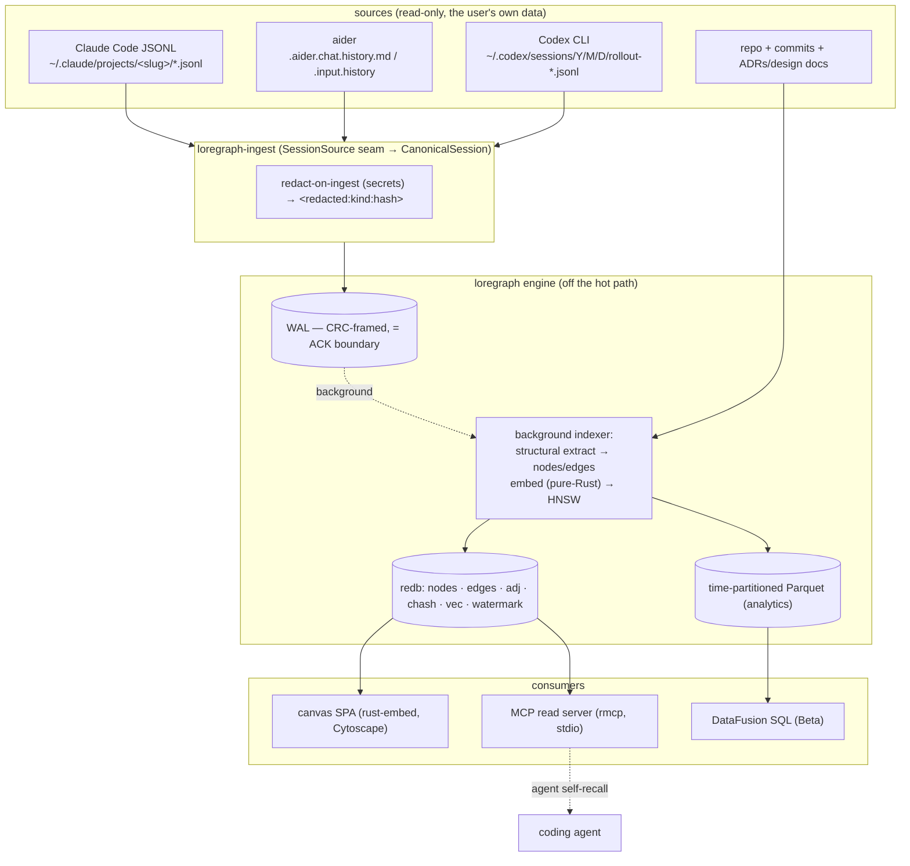

# loregraph — Build Plan (PoC → GA)

> Phased plan for `loregraph` (package `loregraph`, lib/bin `lore`, crate prefix
> `loregraph-`): a persistent **memory knowledge graph** built from the chat
> transcripts your AI coding agents already write to disk, fused with your repo,
> browsable on a canvas and queryable read-only by the agents over MCP. The cut
> stated once, the architecture, the data model, the connectors, the crate stack,
> the build order, and the risks the design owns — honest about what is deferred.
>
> Status: **early PoC — core slice runs** (`index`/`ask`/`serve`/`mcp`/`doctor`; recall
> quality R1–R4 + T1–T2 landed). Last updated 2026-06-29. See [`ARCHITECTURE.md`](./ARCHITECTURE.md)
> §0 for the as-built vs design-target map.

## 0. The cut, stated once

loregraph is **one process, one static musl binary**: it reads the on-disk chat
transcripts coding agents already write (Claude Code JSONL, aider history, Codex CLI
rollouts), fuses them with your repo + git history, and builds a persistent typed
**memory knowledge graph of decisions and implementations** — every value node linked
by **hard provenance edges back to the exact `session_id` and repo `commit`** —
browsable by humans on a pan/zoom canvas and queryable read-only by the agents
themselves over MCP, so nobody re-asks the model what was already decided.

The defensible cut is **not** "a knowledge graph of your chats" (a crowded space — hosted
memory products and local OSS transcript tools alike live here). It is the four-way
intersection no one else holds: **provenance-grade decision edges** (`session_id` + repo
`commit`) + **transcript-native ingest** of the formats agents already write + **read-only
over MCP** so the agent self-recalls + **an air-gapped pure-Rust musl binary with zero
Python/C/ML/network in the default build**. We lead with provenance + air-gap; we concede the
rest loudly in the README.

**The single MVP demo:**

```bash
lore index --sessions ~/.claude/projects --repo .   # build the graph
lore serve                                           # canvas: decisions linked to code
lore ask "what did we decide about retries?"         # → decision + session + file + commit
```

One static binary, no external services, no network.

## 1. Architecture

### 1.1 Data flow

Two producers (chat ingest + repo crunch) feed one durable memory graph through the
crash-safe **WAL→redb** commit protocol; three consumers (canvas, MCP, analytics) read
it. **All heavy/analytical work runs OFF the ingest hot path.**



### 1.2 The engine "seams"

Every seam has a **deps-free default impl** compiled into the air-gap binary, plus a
heavier impl behind a cargo feature. The product *is* the seams + schema; backends are
swappable (the discipline from `recall` and `evald`). All core traits are object-safe,
no async in core.

```rust
// Source ingest
pub trait SessionSource {                 // one per agent format, behind a registry
    fn id(&self) -> ConnectorId;
    fn discover(&self) -> Result<Vec<Source>>;
    fn read(&self, src: &Source, since: &Cursor) -> Result<Box<dyn Iterator<Item=RawRecord>+'_>>;
    fn lower(&self, rec: RawRecord) -> Vec<NormalizedEvent>;   // lenient+lossless; never hard-fails
    fn next_cursor(&self, src: &Source, last: &RawRecord) -> Cursor;
}
// Extraction (structural default; BYO-key LLM later)
pub trait NodeExtractor { fn extract(&self, s: &CanonicalSession) -> (Vec<Node>, Vec<Edge>); }
pub trait SymbolExtractor: Send+Sync {     // Heuristic default | TreeSitter behind feature
    fn extract(&self, lang: Lang, path: &RepoPath, src: &[u8]) -> Vec<RawSymbol>;
    fn fidelity(&self) -> Fidelity;        // Heuristic | Ast
}
// Storage + search + retrieval
pub trait GraphStore: Send+Sync { /* upsert_node/edge (idempotent by hash), neighbors, expand, scan, commit(batch, watermark) */ }
pub trait EmbeddingIndex: Send+Sync { /* insert/search/remove, EmbedderId-stamped */ }
pub trait Embedder: Send+Sync { fn id(&self)->EmbedderId; fn embed(&self,&str)->Result<Vec<f32>>; }
pub trait Retriever: Send+Sync { fn recall(&self, q: &RecallQuery) -> Result<RecallResult>; }
```

Default impls (zero ML/network/C): `MemGraph` (petgraph `StableDiGraph`, rehydrated from
redb, never the source of truth), `BruteForceIndex` (exact-cosine, O(1) upsert),
`HashEmbedder` (deterministic token-bag), and `ask::recall` (a free function, not yet a
`Retriever` trait). **As-built note:** the seams are concrete types today, not the
object-safe traits above; `StaticEmbedder` (real semantic word-vectors) is **runtime-selected
via env, no dependency**. The neural embedder (candle, `neural`) and the pure-Rust zero-dep
HNSW index (`index-hnsw`, a build-time swap for `BruteForceIndex` at the same seam) are
**implemented behind their features**; tree-sitter (`treesitter`) and usearch remain
deferred. See [`ARCHITECTURE.md`](./ARCHITECTURE.md) §0.

## 2. Data model

### 2.1 Node / edge taxonomy

```rust
pub enum NodeKind {
    Session, Turn,                 // chat atoms
    Decision, Implementation,      // the value nodes (provenance-anchored)
    Pattern, DebtSignal,           // ADVISORY (heuristic, confidence + evidence)
    Repo, Module, File, Symbol,    // code graph
    Manifest, Package,             // PRECISE dependency graph
    Commit,                        // git history
    Framework, Tooling, DataSource, DesignDoc, Concept, Person,
}
pub enum EdgeKind {
    // chat ↔ decision
    DecidedIn, Implements, Supersedes, Mentions, DerivedFrom,
    // the fusion edge (repo ↔ chat) — THE product promise
    Touches,            // {turn, node, span, contemporaneous: Oid, stale: bool}
    Produced,           // Decision/Implementation -> File/Symbol it shaped
    // code graph
    Contains, Defines, Imports, DependsOn, References /* treesitter only */,
    ChangedBy, CoChangesWith /* support>=threshold */, Exhibits /* advisory */,
    Uses, RelatesTo,
}
```

### 2.2 Identity (content-addressed, idempotent re-ingest)

`NodeId = blake3(kind_tag ‖ canonical_identity) → u128`. A `chash → NodeId` redb table
makes re-reads no-op upserts; re-ingest is idempotent because identity is content, not
a fresh UUID.

| Kind | Identity payload (canonicalized then blake3) |
|---|---|
| Repo | normalized `remote_url` or first-commit oid |
| File | `repo_id ‖ path ‖ blake3(contents)` |
| Symbol | `file_id ‖ kind ‖ name ‖ signature_hash` |
| Session | `source_tool ‖ native_session_id` |
| Turn | `session_id ‖ turn_index ‖ blake3(content)` |
| Decision | `scope ‖ normalized_title` (restated decision dedups) |

### 2.3 Normalized chat model (the IR that insulates the graph from volatile formats)

```rust
pub struct CanonicalSession { id, agent: AgentKind, repo_root: Option<PathBuf>,
    commit: Option<String>, started_at: DateTime<Utc>, events: Vec<NormalizedEvent>,
    content_hash, provenance }
pub struct Provenance {
    native_session_id: String, native_path: Option<PathBuf>,
    connector_version: String,          // version-gated parse branches
    commit: Option<String>, span: Option<(usize,usize)>,
    source_priority: u8,                // native > proxy > export (cross-source dedup)
    confidence: f32, extractor: ExtractorId, // deterministic-v1 | byo-llm-v1 | manual
}
pub enum MessageKind { User, Assistant, System, Summary, Thinking, Unknown }  // Unknown = load-bearing
pub struct ToolCall { call_id, name, input, result: Option<ToolResult>, effect: Option<Effect> }
pub enum Effect { FileEdit(FileEdit), Command(Command), Artifact(Artifact) }
```

`NormalizedEvent` = `SessionUpsert | TurnUpsert | MessageAppend | ToolCallResolve(call_id,result)`,
each content-hashed. **Every record retains its lossless raw `serde_json::Value`** —
format-drift insurance: a future parser upgrade re-derives better nodes from
already-ingested data without re-reading the source.

### 2.4 Versioning / supersedes

Decisions are **immutable**; a change is a new `Decision` node + a `Supersedes` edge,
plus a derived `status` ∈ {Proposed, Active, Superseded, Rejected}. Retrieval defaults
to `Active`, and can return the superseded chain on request. This is what lets the tool
answer "what did we *used* to think, and why we changed."

## 3. Ingest connectors

Every connector does **discover → read → lower**; the graph builder only ever sees
`NormalizedEvent`s, so it is format-agnostic. **Default build (serde / serde_json /
serde_yaml / blake3 / redb / chrono / uuid) is pure-Rust, zero network.** Network
(`reqwest` rustls), the proxy (axum), and the Cursor SQLite reader live behind cargo
features.

| Connector | Format / location | Cursor | Status | Feature |
|---|---|---|---|---|
| **Claude Code** | `~/.claude/projects/<slug>/*.jsonl`, parentUuid **tree** (not list); slug = cwd with `/`→`-` | ByteOffset | **MVP** (well-supported) | default |
| **Codex CLI** | `~/.codex/sessions/YYYY/MM/DD/rollout-<ISO>-<UUID>.jsonl`; `{timestamp,type,payload}` | ByteOffset | ✅ landed (`src/ingest/codex.rs`) | default |
| **aider** | `.aider.chat.history.md` + `.aider.input.history` (+ `.aider.llm.history` if present) | ByteOffset | MVP-2 | default |
| **Cursor / Cline** | `state.vscdb` SQLite (`cursorDiskKV`); Cline `globalStorage/saoudrizwan.claude-dev/` | RowId/BubbleId | best-effort | `cursor` |
| **OpenRouter proxy** | `lore proxy` axum pass-through, logs locally | GenerationId | best-effort | `proxy` |
| **OpenRouter export** | Activity CSV (likely aggregate-only) + content if logging enabled | GenerationId | best-effort | `openrouter` |
| **OTLP / OpenInference** | spans (the evald overlap) — **read-through an evald store, do NOT re-ingest** | Timestamp | Beta | `otlp` |
| **Manual** | `lore import <file>` + SPA paste/drop | None | MVP | default |

### 3.1 Verified format corrections (checked against live files, June 2026)

- **Claude Code path:** live v2.1.195 is the **flat** layout (`<slug>/*.jsonl`, NO
  `sessions/` subdir); widely-cited web docs claiming a `sessions/` subfolder are stale.
  **`discover()` globs BOTH** `<slug>/*.jsonl` and `<slug>/sessions/*.jsonl` to survive
  either layout.
- **Claude Code record types:** the enumerated set `user|assistant|system|summary` is
  **incomplete** — live installs also emit `queue-operation`, `attachment`,
  `last-prompt`, `isMeta`. **Do not hard-code the type list; `MessageKind::Unknown` is
  the load-bearing fallback.**
- **Claude Code usage:** the 4 token fields
  (`input/output/cache_creation_input/cache_read_input`) are a **subset**; live `usage`
  also carries `cache_creation` (object), `service_tier`, `server_tool_use`,
  `inference_geo`, `speed`, `iterations`. Map only the stable 4 to a typed `Tokens`;
  keep raw for the rest. `tool_use.caller` and `summary.leafUuid` are best-effort,
  not guaranteed.
- **Codex tool shape (was wrong):** there is **no `exec_command` top-level type**.
  Codex emits `response_item` payloads of `type: function_call` (fields `name`,
  `arguments` [JSON string], `call_id`) paired to `function_call_output`
  (`call_id`, `output`). Map by `call_id`, keying on
  `function_call`/`function_call_output`, parsing the concrete tool out of
  `name`/`arguments`. Treat Codex as **3 incompatible eras** (2025/08, mid, ≥0.44) —
  `cli_version` gating is **mandatory, not optional**.
- **aider** files are markdown/plaintext (lossy), not JSON — keep raw-byte retention;
  `.aider.llm.history` is the richest source if present.
- **Cursor / Cline / Codex** are all undocumented + reverse-engineered + version-fragile;
  `discover()` is tolerant of schema drift; Cursor 2.x stability is unconfirmed; read
  Cursor's SQLite **read-only against a copied snapshot** (the editor holds the live db).

### 3.2 Connector trait

```rust
pub trait Connector {
    fn id(&self) -> ConnectorId;
    fn discover(&self) -> anyhow::Result<Vec<Source>>;
    fn read(&self, src: &Source, since: &Cursor)
        -> anyhow::Result<Box<dyn Iterator<Item = RawRecord> + '_>>;
    /// Lenient + lossless: unknown record types -> Message{kind: Unknown}, never an Err.
    fn lower(&self, rec: RawRecord) -> Vec<NormalizedEvent>;
    fn next_cursor(&self, src: &Source, last: &RawRecord) -> Cursor;
}
pub enum Cursor { ByteOffset(u64), RowId(i64), BubbleId(String),
                  GenerationId(String), Timestamp(DateTime<Utc>), None }
```

### 3.3 Incremental, idempotent ingest + secret-scrub

- **Two-level dedup:** (1) the per-source `Cursor` watermark in redb skips
  already-read bytes/rows; (2) `content_hash = blake3(canonicalize(event − volatile
  fields))` makes the upsert idempotent even when a file is rewritten (aider rewrites,
  Cursor vacuum). Cross-source duplicates (same convo via Codex JSONL *and* the
  OpenRouter proxy) resolve by `source_priority` (native > proxy > export) — keep the
  richest, link the rest as alternate provenance.
- **Crash-safe ingest** mirrors the house WAL protocol: stage → `fsync` → **one redb
  txn updating the graph index + per-source cursor watermark together** → recovery
  replays from the persisted cursor (safe because upserts are content-addressed). See
  ARCHITECTURE.md §2 for the full commit protocol.
- **Redaction-on-ingest** (`loregraph-redact`, extending the scanner chassis heuristics:
  provider-key regex + Shannon entropy + `.env`/`Authorization` patterns) runs in
  `lower()` **before persist and before hashing**, replacing matches with stable
  `<redacted:kind:blake3-8>` tokens (so dedup survives). `--raw` is local-only, off by
  default, and loud. The durable store never contains plaintext secrets.
- **`lore doctor`** surfaces per-connector discovery, cursor positions, and "N
  unrecognized lines (format drift)" so drift is visible before it bites.

## 4. Repo crunching

A four-stage pipeline — **discover → extract → mine → link** — run entirely off the hot
path, fusing repo nodes with chat nodes.

### 4.1 Precision split (goes verbatim into README "what is and isn't a moat")

| Sub-capability | Precision | Engine |
|---|---|---|
| Dependency graph | **Precise** | manifest parsers (Cargo/npm/pyproject/go.mod/pom) |
| Git history / churn / who-changed-what | **Precise** | **gix** (pure-Rust, `default-features=false`, the exact the merge gate line) |
| Co-change coupling | **Statistical** | pairwise co-occurrence, suppressed below a support threshold |
| File/Module discovery | **Precise** | `ignore` + `walkdir` (.gitignore aware) |
| Symbol defs (default tier) | **High-recall, approximate** | pure-Rust regex/heuristic scanner (the scanner chassis/55 chassis); confidence-tagged |
| Symbol defs + references (`treesitter` feature) | **Precise** | tree-sitter AST (the **only** C dep, opt-in) |
| Architecture / "uses pattern X" / debt | **Heuristic, advisory** | rule bundles; evidence + confidence on every node; never blocks |
| Chat-turn → code linking | **Best-effort** | span-anchored at contemporaneous commit; degrades to file-level; marks stale |

We do **not** claim semantic code understanding. The default tier emits **defs only**
(high precision) + `Imports`; cross-file `References`/`Calls` are deferred to the
`treesitter` tier because name-based reference resolution is too noisy to assert.

### 4.2 The fusion (the core promise)

The `link` stage resolves file paths + line spans edited in a chat turn against
`File`/`Symbol` nodes **at the commit the chat occurred near**, emitting
`Touches{turn, node, span, contemporaneous, stale}` edges + aggregating sessions into
`Implementation`/`Decision` nodes via `Produced`. When the repo refactored since, carry
the span forward via gix blame/rename detection; degrade to file-level and set
`stale=true` rather than dropping. This is the edge that answers "why is F shaped this
way? / what session last touched this region?"

`Decision` nodes are also extracted from **in-tree artifacts** (ADRs in `docs/adr`,
RFCs, design docs) via a docs-as-source extractor sharing the same node type — not only
from chat.

### 4.3 Incremental re-index (crash-safe)

On HEAD move, diff `old..new`: re-extract only changed files, recompute co-change/debt
deltas for touched scopes, stage → fsync → **one redb txn updating graph tables +
per-repo HEAD watermark** → truncate work-log. Recovery re-extracts above the
watermark.

## 5. Memory retrieval + MCP

### 5.1 `recall()` — the "stop re-asking the agent" API

`Retriever::recall(RecallQuery) → RecallResult` fuses three signals (deterministic,
unit-tested against a fixture corpus, default weights `semantic .45 / graph .35 /
recency .20`):

1. **Resolve seeds** (free text → embed + exact-match mentioned symbols/files; or a
   code region; or a node set).
2. **Semantic candidates** via `EmbeddingIndex::search(seed_vec, k*4)` over
   Turn/Decision/Implementation embeddings.
3. **Graph candidates** via
   `expand(seeds, hops=2, filter={Implements,DecidedIn,Supersedes,DerivedFrom,Mentions,Produced}, cap)`
   — pulls the structurally-relevant ADR even when its wording differs.
4. **Score** = `w_sem·cos + w_graph·(1/path_len)·edge_weight + w_rec·decay(last_seen)`
   + a small precomputed centrality prior.
5. **Supersession filter** — drop `Superseded` (unless asked), promote the superseder.
6. **Return ranked `Evidence`**, each carrying `why` (SemanticMatch | GraphPath |
   Recency | Centrality) + **provenance the agent can cite** (source session/turn/file +
   commit + hash).

Default-build retrieval is **lexical/structural** (token-bag + BM25-ish over node text +
graph proximity); semantic ANN lights up with the `index-hnsw` + `localmodel` features.
**Recall doesn't live or die on embedding quality** — exact + structural provenance
links carry the wedge.

### 5.2 MCP server (`loregraph-mcp`, feature `mcp`, built on official `rmcp` 1.x — provisional pin)

- **Transport:** **stdio by default** (local = trust, no token, zero network, air-gap-safe);
  a **Streamable HTTP** transport (OAuth 2.1 resource server, RFC 8707 audience validation)
  is planned behind a `http` feature.
- **Read tools** (annotated `readOnlyHint:true`): `memory.search`,
  `memory.recall_decision`, `memory.related`, `memory.timeline`.
- **One write tool** (`readOnlyHint:false, destructiveHint:false`): `memory.note` —
  **append-only**, never deletes/overwrites; goes through the same WAL ACK boundary; all
  deletion/merge is human-driven in the canvas. Passive capture from connectors is the
  primary write path; `memory.note` is the agent's opt-in "remember this."
- **Resources:** `lore://node/{id}`, `lore://session/{id}`, `lore://subgraph/{id}`
  (cacheable raw fetch). **Prompt:** `recall-context` ("what did we decide about
  {topic}?").

```jsonc
// memory.recall_decision  { "topic": "storage engine" }  → structuredContent
[{ "id":"dec_7f3a", "topic":"storage engine",
   "decision":"Use redb (pure-Rust ACID) for the durable store.",
   "rationale":"Crash-safe single-file txns, clean static musl, no C deps.",
   "rejected":["sled (weaker txn story)","sqlite (C dep breaks pure-Rust musl)"],
   "decided_at":"2026-05-02T14:11:00Z", "sessions":["sess_19c2"],
   "commit":"a1b2c3d", "confidence":0.9 }]
```

> *Open questions carried:* whether current Claude Code consumes MCP resources/prompts
> or tools-only (verify before promising in the "works today" column); exact `rmcp`
> major pin (1.x is provisional — run `cargo search rmcp` at build time).

### 5.3 Recall quality + node tightness (the token-savings precondition)

**Why this section exists.** loregraph's value over conventional "show-and-tell" prompting
is conditional, not guaranteed: net token savings require **good recall** (the right memory
surfaces) **and tight nodes** (the surfaced memory is small). The PoC ships neither well —
`HashEmbedder` is a 256-dim lexical token-bag, `recall()` has no kind prior (so a 1-token
`Symbol` name out-scores a `Decision`), and a `Decision` node's body is the **whole raw
turn**. Measured against a real `~/.claude/projects` index, `ask "stripe billing"` returns
`Symbol` nodes, not the decision. This section is the roadmap to fix both halves. Ordered by
ROI (impact ÷ effort); each is a discrete, independently-shippable build step.

#### Good recall

| # | Feature | Tier | Deps | What / why |
|---|---|---|---|---|
| R1 | **Kind-aware recall** | ✅ PoC | none | Two parts: (a) restrict the **semantic** candidate set to value/chat nodes (`is_semantic_memory`: Decision/Implementation/Turn/Session/DesignDoc/Concept/Pattern/DebtSignal) — a code atom's 1–2-token name bag is pure `HashEmbedder` noise and was flooding "what did we decide"; (b) a per-`NodeKind` **prior** (`kind_weight`: Decision/Implementation 1.0 → Turn 0.85 → Symbol 0.3) on the graph + lexical passes. Code atoms still surface — graph-expanded from a real seed, or via exact lexical name match merged into the indexed path before ranking — just never as a fuzzy semantic hit. Verified against the real index: "stripe billing" / "WAL" now return the actual Turns/Decisions (with provenance), not `Symbol`s. **The visible fix.** |
| R2 | **Static semantic embedder** | ✅ (static) / Beta (neural) | none (static) | `StaticEmbedder`: real **semantic** recall via a local static word-embedding table (the model2vec idea — token→vector lookup + mean-pool, **no inference, no ONNX/C, no network at query time**). Loads a GloVe-format vectors file the operator supplies (`LORE_EMBED_BACKEND=static LORE_EMBED_MODEL=…`); air-gap clean. The `Embedder` seam now stamps an **embedder id + dim** into the store and **refuses to open under a mismatched embedder** (cosine across dims is meaningless). Verified: query "persistent database" recalls a "durable store" turn with **zero shared words** (hash scores ~0). The static table needs no dependency so it always compiles. **Neural (contextual) embedder now landed behind `--features neural`**: `NeuralEmbedder` runs a local BERT-family model (candle, pure-Rust CPU — no ONNX/C) from a model dir (`config.json`+`tokenizer.json`+`model.safetensors`, e.g. all-MiniLM-L6-v2), tokenize → forward → attention-masked mean-pool → L2-normalize, no network at query time (`LORE_EMBED_BACKEND=neural`). Compiles clean; runtime inference needs the operator's model dir. |
| R3 | **BM25 lexical fallback** | ✅ MVP | none | Replaced the raw substring-count fallback with length-normalized, IDF-weighted **BM25** (Okapi k1=1.2, b=0.75) over node text, still ×`kind_weight`. Rare query terms now carry weight and a long body no longer wins on length. Makes the **air-gap default** (no model loaded) genuinely usable, not just `degraded`. |
| R4 | **Centrality prior + supersession filter** | ✅ MVP | none | (a) **Centrality prior**: a `ln(1+degree)` nudge applied **only to `Decision`/`Implementation`** — for a value node, high degree means it shaped many files / recurred across sessions (real importance); structural hubs (`Session`/`Repo`, huge fanout) get no prior, else they flood recall (observed + fixed). (b) **Supersession filter**: recall redirects a superseded node to the decision that replaced it (`MemGraph.superseded_by`, following the `Supersedes` chain to its head), so a stale decision never out-ranks or hides its superseder. The filter is live + tested. (c) **Drift detection** (`Store::detect_supersessions`, runs at the end of `index`): a decision that **explicitly** names what it replaces (`… instead of <X>`) supersedes the **unique** older decision in the **same scope** whose text contains `<X>` — high-precision-only, never inferred from topic similarity (a false positive would hide a valid decision), ambiguous/same-time pairs skipped. Verified on the real index: 2 conservative links. |

#### Tight nodes (the token lever)

| # | Feature | Tier | Deps | What / why |
|---|---|---|---|---|
| T1 | **Distilled decision extraction + noise filter** | ✅ MVP | none | (a) **Control/command-noise filter** (`is_low_value_turn`): slash-command wrappers (`<command-name>`/`<command-message>`), local-command output, interrupt/`Caveat:` banners no longer become `Turn` nodes or decision candidates — they were surfacing as fake "memories" (e.g. `<command-name>/clear`). (b) **Substance floor**: a bare cue match with no decision content (`< MIN_DECISION_WORDS`) is dropped, so a node is a tight claim, not a fragment. (The cue extractor already lifts the cue *sentence*, ≤280 chars, not the whole turn.) Verified on the real index: the noisy "EKS version pin" query now returns the actual `var.eks_version default is 1.36` turn, not `/clear`/`/model` junk. Remaining: dedup near-identical candidates within a session (node-identity already dedups exact restatements). |
| T2 | **`summary` vs `body` split** | ✅ MVP | none | `Node.summary` (a `summarize()` distillation: whitespace-collapsed, first sentence, ≤180 chars) is distinct from the full `body`. Recall (`ask`/`/v1/search`) and the **bulk** canvas responses (`/v1/graph`, `/v1/graph/neighbors`) return only `summary` — a few tokens, not a paragraph — while the full `body` ships only on the `/v1/node/{id}` drill-down. Decouples "what surfaced" size from "drill-down" size; `#[serde(default)]` keeps pre-T2 stores readable. |
| T3 | **`byo-llm-v1` extractor** | ✅ Beta (feature) | `reqwest` (BYO key) | A BYO-key LLM distills a turn → the tight `{decision, rationale, rejected[]}` struct (§5.2). OFF the air-gap default; behind `--features byo-llm`. **Dual-provider** (`src/llm.rs`): OpenAI `/v1/chat/completions` **and** Anthropic `/v1/messages` (auto-detected from the host, or `LORE_LLM_PROVIDER`), pure `build_request`/`parse_response` per dialect unit-tested with no key/network. **Wired** (`store::extract_decisions` → `llm_augment`): the candidate turns are re-distilled by the LLM, stamping `extractor="byo-llm-v1"` + `rationale`/`rejected`; **any error (no key, 4xx, network) falls back to the deterministic candidate**, so decisions are never dropped. Live-exercised against Anthropic: the request format was accepted (a clean `authentication_error` proves headers/body are well-formed) and the fallback fired — verified end-to-end to the auth boundary (a valid key returns the distilled decisions). |

**Sequencing:** R1 + T1 + R2 (static) + R3 + R4 + T2 done — **the entire deterministic,
no-new-dependency recall-quality + node-tightness set has landed**, verified against fixtures
and the real index. The Beta quality tier remains: the heavier **neural R2 backend**
(fastembed/candle transformer inference, behind a cargo feature), **T3 `byo-llm-v1`** (BYO-key
LLM distillation via `reqwest`, off the air-gap default). Each needs a dependency and/or
network + a model or API key, so each is its own verified PR rather than part of this
deterministic set. (**Supersedes drift detection** has since landed — `detect_supersessions`,
high-precision explicit-`instead of` only — making the R4 filter fire automatically.)

## 6. Canvas GUI

**Ships exactly like evald (evald):** vanilla-JS SPA in `frontend/`, embedded via
`rust-embed` 8, served as the axum fallback. **No Node toolchain, no npm at build
time.** Vendor prebuilt UMD bundles into `frontend/vendor/<lib>/`, pinned by version +
SHA-256, each with its upstream LICENSE; an offline `ops/vendor-frontend.sh`
re-downloads + verifies on version bump (never at user build time). **CSP `default-src
'self'`** so any accidental CDN fetch fails loudly in dev.

**Renderer — two tiers, one renderer-agnostic JSON contract:**

| Tier | Lib (MIT) | Tech | Comfort | When |
|---|---|---|---|---|
| **MVP default** | Cytoscape.js 3.x (~88 KB) + cytoscape-fcose | Canvas2D, fCoSE | ~3–5k nodes | the common single-dev case |
| **Scale (flagged)** | Sigma.js v3 + graphology + FA2 worker | WebGL, off-main-thread layout | 5k–100k | large team/org graphs |
| **Future** | cosmos.gl (GPU) | regl/WebGL | 100k–1M+ | parked, documented only |

d3-force rejected (a simulation, not a renderer; SVG dies past ~5k). Hand-rolled
Canvas2D rejected (weeks of work, no WebGL path). Both renderers hide behind one
internal `Renderer` interface (`loadGraph/focus/setCluster/scrubTime/onNodeClick/fit`);
ship Cytoscape-only for MVP/Beta, add Sigma only when a real graph exceeds the Canvas
ceiling. The switch is **frontend-only** because the wire contract is renderer-blind.

**Anti-hairball by construction:** never render-everything. Open on a BFS neighborhood
(`/v1/graph/neighbors?id=&depth=1..2`), expand on demand, cluster-by-type/repo/time,
server-side layout precompute + level-of-detail. Full-graph render is explicitly out of
scope.

**Endpoints (renderer-blind, neutral JSON):**

- `GET /v1/graph?types=&repo=&since=&until=&limit=&cursor=` → `{nodes, edges, page}`
- `GET /v1/graph/neighbors?id=&depth=&limit=` → BFS (the on-open call)
- `GET /v1/search?q=&k=` → ranked `[{id,score,snippet,type}]`; **degrades to lexical
  with a banner if no vector index** (not an error)
- `GET /v1/node/{id}` → side-panel detail + provenance + `first_seen_ts` /
  `last_updated_ts`

**Time-scrub** filters on an immutable `first_seen_ts` (distinct from
`last_updated_ts`) stamped at ingest — a data-model contract honored across
re-ingest/dedup. **XSS guard:** all node/edge/code text via `textContent`/`escapeHtml`,
code in `<pre>`, CSP blocks inline script.

## 7. Crate stack (pinned to repo versions)

| Crate | Pin | Role | Why |
|---|---|---|---|
| tokio | 1 | runtime, bounded mpsc | backpressure via `send().await`, no silent drop |
| axum | **0.8** | HTTP API + canvas SPA fallback | matches evald |
| tower-http | 0.7 | static fs + gzip + fallback | SPA serving |
| **redb** | **4.1** | durable graph: nodes/edges/adj/chash/vec/watermark | pure-Rust ACID; **see note — NOT the repo-wide norm** |
| datafusion / arrow / parquet | **54 / 58 / 58** | **Beta** SQL/analytics over Parquet snapshots | pure-Rust, no C++, clean static musl, off-hot-path |
| rust-embed | 8 | embed vanilla-JS canvas SPA | air-gap, no Node (evald precedent) |
| petgraph | 0.8 | in-memory `MemGraph` traversal/layout | pure-Rust (dagron dagron-core precedent) |
| serde / serde_json | 1 | transcripts + wire JSON | JSONL sources |
| serde_yaml | 0.9 | config + ingest rules | repo norm |
| clap | 4 | CLI (`index`/`serve`/`ask`/`mcp`/`doctor`) | headless-first |
| blake3 | 1 | content-addressed ids + dedup + redaction hashes | pure-Rust |
| crc32fast | 1 | WAL CRC (torn-tail detection) | durability norm |
| chrono | 0.4 | timestamps, timeline | repo norm |
| uuid | 1 | synthetic ids | repo norm |
| tracing (+subscriber) | 0.1 / 0.3 | self-observability | repo norm |
| anyhow / thiserror | 1 / 2 | bin/lib errors | repo norm |
| **gix** | matches the merge gate line, `default-features=false` | pure-Rust git history mining | no C dep (vs git2/libgit2) |
| `loregraph-index` (HNSW) | in-tree | pure-Rust zero-dep ANN | air-gap; recall-index precedent |
| reqwest | 0.12, **`default-features=false, features=["rustls-tls","json"]`** | BYO-key LLM extraction ONLY (feature `byo-llm`) | no OpenSSL/C; not in default path |
| rmcp | **1.x (provisional)** | MCP server (`transport-io`+`macros`+`schemars`) | official SDK; behind `mcp` feature |
| tree-sitter (+grammars) | _pin when wired_ | **feature `treesitter`** — precise symbols | **C dep, musl care, OFF by default** |
| usearch | _pin when wired_ | **feature `usearch`** — alt ANN at scale | **C++, musl care, OFF by default** |
| fastembed / candle / model2vec | _pin when wired_ | **feature `localmodel`** — real local embeddings | heavy, OFF by default |

**Default build invariant: ZERO ML / network / C deps.** All pins exist on crates.io and
match precedent; nothing C-linked is in any default build.

**Version-norm note (does not block a green build):** **redb 4.1.** 4.1 is a major jump
(2→3→4) with breaking API changes vs the redb `2` other modules pin; pinning 4.1 follows the
most-recent precedent (evald) — stated explicitly so the store impl uses the redb 4.x API
and **does not copy redb v2-era patterns**.

## 8. Workspace layout & root wiring

### 8.1 Phase 0 — single crate

Ship the PoC as **one package** with the binary + library in the same crate. `Cargo.toml`:

```toml
[package]
name = "loregraph"
version = "0.1.0"
edition = "2021"
license = "Apache-2.0"
description = "loregraph — memory knowledge-graph for AI coding-agent sessions + repos (single binary). PoC: chat ingest + graph + canvas."
repository = "https://github.com/lucheeseng827/loregraph"
publish = true
[profile.release]
opt-level = "z"
lto = true
codegen-units = 1
strip = true
[lib]
name = "lore"
path = "src/lib.rs"
[[bin]]
name = "lore"
path = "src/main.rs"
```

### 8.2 Graduation — standalone workspace

When loregraph outgrows a single crate, convert `Cargo.toml` to a `[workspace]` root
(`members = ["crates/loregraph-*"]`) and split into
`crates/loregraph-{core,ingest,coderepo,graph,embed,store,api,mcp,cli}`, each with the same
deps-free-default / feature-gated-heavy discipline as the single-crate cut. No public-facing
behavior changes — it is purely an internal crate split, so the binary, the CLI, and the
on-disk store stay identical.

## 9. Phases

### PoC — v0.1.0-alpha (single crate, no public mirror)

**IN:** Claude Code JSONL adapter → CanonicalSession + raw blob; regex repo symbol/file
extraction; redb store + WAL commit protocol; HashEmbedder + in-tree HNSW; `lore index`
+ `lore ask` headless.
**OUT:** canvas, other sources, MCP, DataFusion.

Build steps (each independently demoable):
1. Claude Code adapter → normalized stdout (`lore index --dry-run`).
2. redb + content-addressed blobs + commit protocol; **kill-9 survives**.
3. repo walk + regex symbols + `Touches`/`References`.
4. HashEmbedder + HNSW + `lore ask` (vector + BFS). ✅ `BruteForceIndex` default + pure-Rust
   HNSW behind `--features index-hnsw` (`VectorIndex` enum, recall@1 ≥ 0.98 vs the exact oracle
   at 256-dim).

### MVP — v0.1.0 (first public OSS release)

**The demo:** `lore index --sessions ~/.claude/projects --repo .` → `lore serve` →
canvas shows decisions linked to code → `lore ask "what did we decide about retries?"`
returns decision + session + file.

**IN:** Claude Code + manual ingest with redaction; repo regex extraction; rule-based
decision extraction; redb graph kill-9-durable; lexical+HNSW search + bounded BFS;
**stdio MCP server** (5 tools); axum API + **embedded Cytoscape canvas** (neighbor-first,
server-side layout); CLI `index/serve/ask/mcp/doctor`; Apache LICENSE/NOTICE + README
(mermaid + honest moat) + PLAN; static musl x86_64 + aarch64 via
cargo-dist + Homebrew + binstall + distroless.

Build steps:
5. decision extraction → `Decision` nodes. ✅
6. ✅ **MCP server (`--features mcp`, rmcp 1.8 stdio).** `lore mcp` serves the 5 tools
   (`memory.search` / `recall_decision` / `related` / `timeline` read + append-only
   `memory.note`) over stdio; verified with a real `initialize` → `tools/list` →
   `tools/call` round-trip. Default build stays pure-Rust (rmcp is opt-in).
7. axum API + canvas. ✅ (PoC Canvas2D renderer; Cytoscape/Sigma tiers per §6.)
8. redaction + golden-fixture tests + release. ✅ redaction + tests; release packaging
   **scaffolded** — hand-rolled (no cargo-dist): static-musl x86_64+aarch64 + macOS + Windows
   build matrix, GitHub release with `SHA256SUMS`, `cargo-binstall` metadata, a Homebrew formula
   (repo-as-tap, auto-bumped), and a multi-arch distroless image to ghcr (`ops/release.yml` →
   mirror `.github/workflows/release.yml`, `Dockerfile`, `Formula/lore.rb`). Pending: cut the
   first real `v*` tag on the mirror to exercise it end-to-end (+ crates.io publish to light up
   `cargo binstall`).
9. **recall quality (§5.3):** R1 kind-aware scoring (now) + T1 distilled decisions + R3 BM25
   fallback + R4 full hybrid/supersession + T2 summary/body split — the no-ML half of the
   token-savings precondition.

**OUT** (each named, not dropped): aider/Cursor adapters; tree-sitter; DataFusion. (Codex
adapter and the BYO-key LLM extractor have since landed behind their features.)

### Beta — v0.5.0

Codex + aider + Cursor/Cline + OpenRouter + OTLP (read-through-evald) adapters (each
`cli_version`/format-version gated); `treesitter` feature; **DataFusion 54 over Parquet
snapshots** (timelines, provenance rollups, off-hot-path); **R2 `localmodel` semantic
embeddings + T3 `byo-llm-v1` distilled extraction (§5.3)** — the quality ceiling-raiser;
supersedes drift detection; Sigma WebGL tier if a
real graph exceeds Canvas; MCP resources + `recall-context` prompt + HTTP transport
prototype. Publish recall@k in BENCHMARKS.md; benchmark canvas at 50k nodes.

### GA — v1.0.0

Frozen redb/blob schema + migrations; stable HTTP/CLI/MCP API; format-version-pinned
adapters with forward-compat fixtures; **gated behind a kill-9 crash-recovery +
re-index-under-load soak.** `/security-review` gate before tagging (the graph holds source
code + decisions — a wide blast radius).

## 10. Risks the design owns

- **[high] Format drift** — all on-disk formats are undocumented and version-fragile
  (Claude Code adds `queue-operation`/`attachment`/`last-prompt`; Codex has 3
  incompatible eras; Cursor `cursorDiskKV` mutates). → Lenient+lossless parse (raw
  retained, `Unknown` fallback), per-connector `cli_version`/`version` gating,
  golden-fixture corpus per producer version, `lore doctor` surfaces
  unrecognized-line counts.
- **[high] Thin/owned moat** — the transcript→decision-graph wedge and code-graph-over-MCP
  are already shipped elsewhere; MCP exposure is commodity. → Lead with provenance edges +
  air-gap pure-Rust, concede the rest loudly in the README.
- **[high] Secret leakage** — transcripts are dense with keys/`.env`/tokens. → Redact at
  ingest before persist/hash, default-on; `--raw` local-only and loud; `lore redact --audit`
  re-scans.
- **[high] Canvas layout perf at scale** — force-directed hairballs past a few thousand
  nodes. → neighbor-first + server-side layout + level-of-detail + viewport-bounded
  queries; WebGL tier only when measured; full-graph render out of scope.
- **[med] Embedding quality in the air-gap default** — a hash/static embedder is weak. →
  lead with exact + structural provenance links; real embeddings behind a feature;
  publish recall@k honestly.
- **[med] Stale/contradictory memory** — superseded decisions mislead. → `Supersedes`
  edges + status + recency surfaced in MCP answers ("decided 2026-01, code last changed
  2026-06"), never asserted as truth.
- **[med] Heuristic false positives** (symbol scanner, pattern detection) — pollute
  trust. → confidence-tag everything, strip comments/strings pre-pass, defs-only in the
  default tier, advisory nodes never block, threshold-gate co-change.
- **[med] Chat↔code mis-attribution after refactor** — anchor at the contemporaneous
  commit, carry forward via gix blame/rename, mark stale rather than drop.
