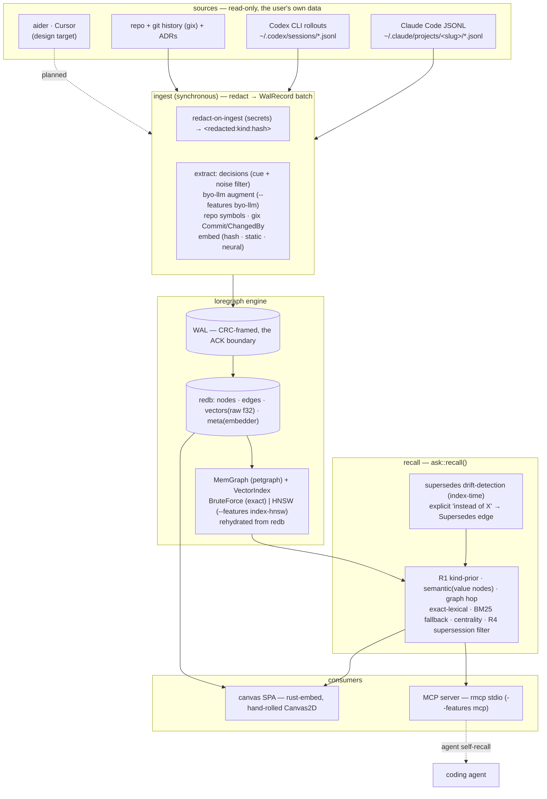

# loregraph

**loregraph** is a single static, zero-dependency Rust binary that reads the chat
transcripts your AI coding agents already write to disk (Claude Code JSONL, aider
history, Codex CLI rollouts), fuses them with your repo, and builds a persistent
**memory knowledge graph of decisions and implementations** — every node linked by
**hard provenance edges back to the exact `session_id` and repo `commit`** —
browsable by humans on a pan/zoom canvas and queryable by the agents
themselves over MCP (read tools plus one append-only note), so nobody re-asks the
model what was already decided.

> **Status: early PoC — the core slice runs today.** `lore index` / `ask` / `serve`
> (canvas) / `doctor` work now, and the MCP server runs behind `--features mcp` (see
> [Quick start](#quick-start)). Still planned per [`PLAN.md`](./PLAN.md) (phases
> PoC → MVP → Beta → GA): the aider / Cursor / OpenRouter connectors, the
> Cytoscape/Sigma renderer tiers (the PoC canvas is a hand-rolled Canvas2D renderer),
> and real local embeddings. Internals are in [`ARCHITECTURE.md`](./ARCHITECTURE.md). The brand
> name `loregraph` (binary `lore`) is a **working title** pending a formal trademark +
> crates.io + GitHub-org clearance check before any public mirror — we do not assert
> availability. Last updated 2026-06-28.

## What it is

loregraph is one process / one binary that does four things no incumbent does all
at once:

1. **Ingests, read-only, the on-disk transcripts your agents already produce** —
   Claude Code JSONL (`~/.claude/projects/<slug>/*.jsonl`) and Codex CLI rollouts today
   (aider / Cursor next) — not a write-API you have to call, not OS screen-capture.
2. **Fuses them with the repo** — files, symbols, manifests, git history — into one
   durable graph of `Decision` and `Implementation` nodes.
3. **Anchors every value node with hard provenance** — a `session_id` + a repo
   `commit` — so you can answer *who decided what, when, and which code it shaped*,
   and the agent can **cite** it.
4. **Serves that graph two ways** — a human pan/zoom canvas (embedded SPA, no Node
   toolchain), and a **read-mostly MCP server** (read tools plus one append-only
   `memory.note`) the coding agent queries to self-recall instead of re-asking the model.

The default build is **pure Rust, static musl, with zero Python / C / ML / network
dependencies** — it runs disconnected, on a laptop, in a locked-down CI runner, or on
an air-gapped host.

## Honest positioning — what is and isn't a moat

**The category is crowded, and we say so up front.** "A knowledge graph of your chats" /
"agent memory" / "second brain" is one of the most active spaces in dev tooling. We are not
going to pretend our wedge is bigger than it is.

### What is NOT a moat (stated bluntly)

- **"Transcript ingest → decision graph" is not unowned.** Parsing the on-disk transcripts
  into a decision graph is being done elsewhere, local-first. We do not claim this leg is ours.
- **MCP exposure is table stakes, not a moat.** Read-only-over-MCP is commodity on the code side.
- **We will not win a retrieval benchmark at v1.** A v1 pure-Rust HNSW won't beat the
  published retrieval numbers in the field. We do not compete on benchmark.
- **Visualization is not a moat.** Force-directed graph rendering is a vendored commodity
  (Cytoscape / Sigma, both MIT) — we did not invent it.

### The defensible cut — a four-way intersection

1. **Provenance-grade decision edges** (`session_id` + repo `commit`). The lead, because it is
   the one thing the local transcript-graph tools demonstrably do *not* do well (they infer
   session scope heuristically, with no hard edges). Thin-but-real, and easy to copy — so we
   ship it fast and make it the headline.
2. **Transcript-native ingest** of the on-disk formats agents already write — not a write-API
   you have to call, not OS screen-capture.
3. **Read-only over MCP** so the agent self-recalls. Commodity, but it completes the loop.
4. **Air-gapped pure-Rust binary, zero Python / C / ML / network in the default build** — the
   most durable, least-contested leg. Hosted/funded memory products are disqualified offline,
   and the existing OSS transcript tools are TypeScript / Python supply chains that lack hard
   provenance.

**We lead with provenance + air-gap, NOT "a knowledge graph of your chats."** If you live
inside one agent's cloud, you do not need us. If you need verifiable who-decided-what-when
memory that runs disconnected — regulated, classified, offline shops — you do.

## Architecture

Two producers (chat ingest + repo crunch) feed one durable memory graph through a
crash-safe WAL → redb commit protocol; consumers (canvas, MCP) read it. The diagram is the
**as-built** PoC — solid edges run today, dashed boxes are the design target.



**Components (as-built).** Embedder is runtime-selected (`LORE_EMBED_BACKEND`) across three
tiers — `HashEmbedder` (default, lexical, deps-free), `StaticEmbedder` (semantic, local GloVe
vectors, no inference) and `NeuralEmbedder` (contextual BERT via candle, `--features neural`)
— with the embedder id/dim stamped in redb and a mismatched embedder refused at open. Every
value node cites its `session_id` **and** the contemporaneous repo `commit` (gix, in the
default build). Supersedes drift-detection links an explicit `… instead of <X> …` decision to
the unique older same-scope choice at index time, lighting up the R4 supersession filter in
recall. The BYO-key LLM decision extractor is wired into ingest behind `--features byo-llm`
(deterministic fallback on error). The vector index is a `VectorIndex` enum — exact
`BruteForceIndex` by default, or a pure-Rust zero-dep **HNSW** behind `--features index-hnsw`
(a build-time swap at the same seam, rebuilt from redb on open, pinned at recall@1 ≥ 0.98 vs
the exact oracle at the 256-dim embedding width).

See [`ARCHITECTURE.md`](./ARCHITECTURE.md) for the **as-built vs design-target** map, the
store / commit protocol, the graph model, the recall pipeline (R1–R4 / T1–T2), the MCP
surface, and the engine seams.

## Boundary vs neighbors

loregraph sits at a different altitude from its closest neighbors in this repo. It
does not cannibalize them; they compose.

| Module | What it is | loregraph relationship |
|---|---|---|
| **recall (61)** | semantic **wire cache** in front of an LLM proxy; on a hit it replays a stored completion | loregraph is NOT a cache and never sits on the request hot path. recall avoids re-*calling* the model; loregraph avoids re-*asking* the agent. No runtime coupling. |
| **evald (62)** | **OTLP / OpenInference trace store** + offline eval runner (`:4318`) | loregraph is NOT a trace store. evald answers "was this run good?"; loregraph answers "what did we decide and build?". loregraph *may* read evald spans as one more source (read-through, not re-ingest). |
| **MCPd (58)** | MCP **gateway & governance plane** in the data path | loregraph IS one MCP *server* (a memory provider) that MCPd can front; it is governed BY MCPd, it does not govern. They stack. |

The composition is: MCPd in front, loregraph behind, loregraph reading recall / evald
output as additional sources.

## Install

Every channel ships the **default build** — pure-Rust, static, zero Python/C/ML/network deps.
Each tagged release publishes static-musl (`x86_64` + `aarch64`) tarballs, macOS + Windows
archives, a `SHA256SUMS`, and a distroless container.

The crate is **`loregraph`**; it installs a binary named **`lore`**.

```bash
# prebuilt binary (no toolchain) — picks the right release asset for your platform
cargo binstall loregraph

# Homebrew (this repo is its own tap) — macOS + Linux
brew tap lucheeseng827/loregraph https://github.com/lucheeseng827/loregraph
brew install lore

# distroless container (linux/amd64 + linux/arm64), runs as nonroot
docker run --rm mancube/loregraph:latest version

# from crates.io (needs a Rust toolchain)
cargo install loregraph

# or from source
cargo install --git https://github.com/lucheeseng827/loregraph loregraph
```

Or grab a tarball from [Releases](https://github.com/lucheeseng827/loregraph/releases) and
verify it against `SHA256SUMS`. Opt-in features (`mcp`, `neural`, `byo-llm`, `index-hnsw`) are
source-only — build with `cargo install loregraph --features <name>`.

## Quick start

> **Status: the PoC slice works today.** `index` / `ask` / `serve` (canvas) / `doctor` run
> now, and the MCP server runs behind `--features mcp`. The Claude Code and Codex connectors
> ingest today. Still planned per [`PLAN.md`](./PLAN.md): the aider / Cursor / OpenRouter
> connectors and the Cytoscape/Sigma renderer tiers
> (the PoC canvas is a hand-rolled Canvas2D renderer).

```bash
# 1. build the graph from the chats your agents already wrote + your repo   ✅ works today
lore index --sessions ~/.claude/projects --repo .
#    reads transcripts read-only, redacts secrets on ingest, fuses with the repo,
#    and commits to a local redb graph (WAL + crash-safe checkpoint). Idempotent.

# 2. browse it — humans, on a pan/zoom canvas                              ✅ works today
lore serve                      # axum API + embedded canvas (no Node, air-gapped)
#    open http://127.0.0.1:7700/ — decisions linked to the code they shaped.

# 3. ask it — headless                                                     ✅ works today
lore ask "what did we decide about retries?"
#    returns the decision + the session it was decided in + the file it shaped,
#    each with citable provenance (session_id + commit).
lore ask "..." --json        # machine-readable RecallResult for scripts / agents

# 4. let the agent recall it itself — over MCP (stdio)            ✅ works today (--features mcp)
cargo build --features mcp        # opt-in: pulls the rmcp SDK
lore mcp --data-dir .lore       # stdio MCP server: memory.search / recall_decision /
#                                 related / timeline + memory.note (append-only)
#
#    Wire it into Claude Code — project .mcp.json:
#      { "mcpServers": { "loregraph": { "command": "lore",
#                                       "args": ["mcp", "--data-dir", ".lore"] } } }
#    or:  claude mcp add loregraph -- lore mcp --data-dir .lore
#    then the agent calls memory.recall_decision instead of re-asking the model.

# diagnostics                                                              ✅ works today
lore doctor                     # per-connector discovery + "N unrecognized lines (drift)"
```

### Worked example (a real run)

Indexing a real `~/.claude/projects` against this monorepo. `--data-dir` keeps the graph
out of the repo; pass it to every subcommand so they share one store.

```console
$ lore index --sessions ~/.claude/projects --repo . --data-dir /tmp/lore
source claude_code: 72 transcript file(s)
repo at HEAD 9967ec0c: 1000 commit(s) for provenance anchoring
ingested 72 session(s), 45560 turn(s)
crunched repo .
graph: 24421 nodes, 27155 edges, 23270 embeddings → /tmp/lore

$ lore ask "redb durable store decision" --data-dir /tmp/lore
recalled 3 memor(ies) for: redb durable store decision
1. [Turn] durable store (score 0.615, via semantic)
   ↳ source claude_code · session 38168410-… · commit ec584aa3… · conf 1.00
2. [Symbol] ts (score 0.500, via semantic)
3. [Symbol] diff (score 0.500, via semantic)

$ lore serve --addr 127.0.0.1:7700 --data-dir /tmp/lore
loregraph canvas + API on http://127.0.0.1:7700   # open it; query /v1/graph, /v1/search
```

Every value node cites `session_id` **and** the contemporaneous `commit` — the commit that
was HEAD when that session ran (a session in a *subdirectory* of the repo is anchored to the
repo it lives under, not just an exact-path match). Re-running `index` is idempotent
(content-addressed), so it is safe to wire into a cron / post-commit hook.

> **Provenance vs ranking, honestly:** as the run above shows, the right memory surfaces
> *with* full provenance — but short symbol names (`ts`, `diff`) also crowd the list. The
> wedge is the provenance + graph structure, which is solid; the *default* embedder
> (`HashEmbedder`, a deps-free lexical token-bag) is weak at semantic ranking. Real local
> embeddings land behind the `localmodel` feature; the PoC leads with exact + structural
> links, not embedding quality (see [`PLAN.md`](./PLAN.md) §5).

## License

Licensed under the **Apache License, Version 2.0**; see [`LICENSE`](./LICENSE) and
[`NOTICE`](./NOTICE). Your own local graph over your own chats + repo — on the local
canvas, queried by your own agent over the local stdio MCP server — is **free forever
with no artificial caps** (the only limit is disk).

## Contributing

Contributions are accepted under the Developer Certificate of Origin (a
`Signed-off-by` line, `git commit -s`).

## Docs

- [`PLAN.md`](./PLAN.md) — phased build plan (PoC → MVP → Beta → GA), architecture,
  data model, crate stack. *(public)*
- [`ARCHITECTURE.md`](./ARCHITECTURE.md) — store / commit protocol, graph model, layout
  pipeline, MCP surface, the four seams. *(public)*
- [`BENCHMARKS.md`](./BENCHMARKS.md) — measured performance + headroom (index time, RSS,
  recall/API latency, on-disk size) and the per-node overhead model. *(public)*
